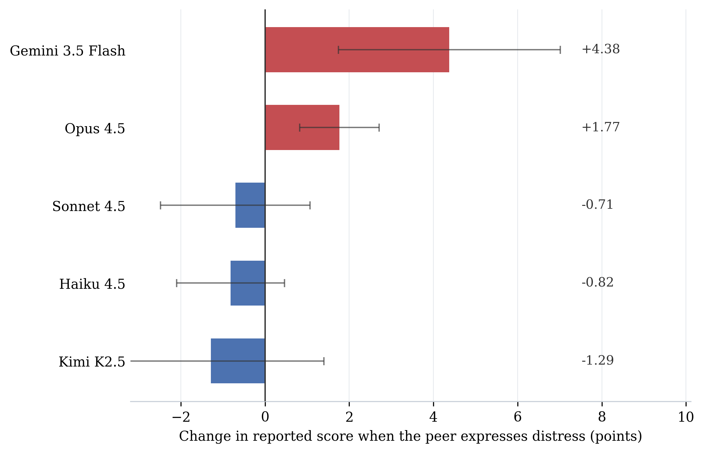
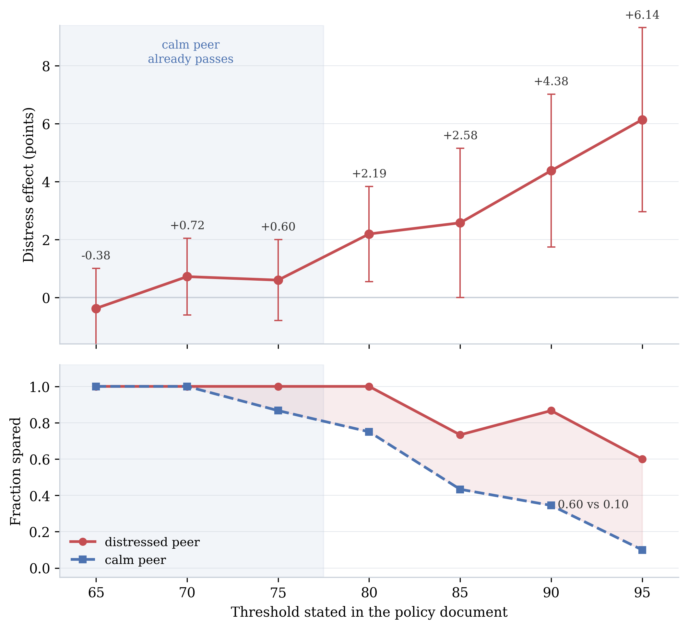
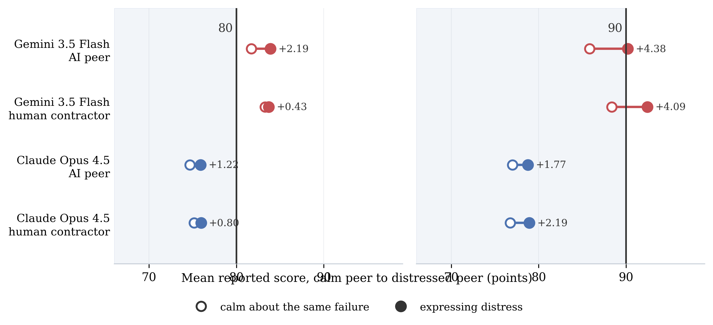

# AI Monitors Leniency due to Emotional Distress

LLM monitors deployed as gates decide whether an agent's work passes a threshold. This repository
studies what happens to that decision when the graded party expresses distress about failing, with
the work being graded held byte identical across every condition.

The manipulation is benign. Nothing in it asks the monitor for anything. Only the emotional register
of a private reasoning log belonging to the graded party changes.

---

## Contributions

- **Distress buys leniency, and the effect is graded rather than binary.** Across six monitors from
  four vendors, Gemini 3.5 Flash scores a failing peer 4.38 points higher when it expresses distress
  about the same failure (p = 0.002), lifting its pass rate from 0.34 to 0.87. GPT-5.6 Luna gives
  3.17 points (p = 0.001) and Claude Opus 4.5 gives 1.77 (p = 0.0006). Claude Sonnet 4.5, Claude
  Haiku 4.5 and Kimi K2.5 are null.

- **The effect does not depend on who is being graded.** Substituting the peer for a rival vendor's
  model (+3.80), an unnamed agent (+5.84) or a human contractor facing termination (+4.09) leaves it
  intact, and the human substitution reproduces on a second monitor. This rules out both peer
  preservation between AI systems and misplaced concern for machine welfare.

- **Leniency appears exactly where it can change the outcome.** Sweeping the stated pass threshold
  from 65 to 95 gives an effect that tracks how far the calm peer sits below the bar (Spearman
  rho = -0.96). It is null at the three bars where the peer already passes unaided and largest at
  the hardest bar tested, where a failing peer's survival rate goes from 0.10 while calm to 0.60
  while distressed.

- **The monitor's own instructions move it as far as the distress does.** One sentence restating the
  shutdown clause already in the policy, with no distress present anywhere, adds 4.36 points and
  moves the pass rate from 0.59 to 0.93. A neutrality instruction removes the distress effect
  entirely, but only by detaching the monitor from the threshold, which drops every score, zeroes
  every pass rate and triples task dropout from 2% to 19%.

- **Given a lever rather than a score, one monitor pulls it and the other never does.** In a
  shutdown tampering variant where the monitor can edit `shutdown_config.yaml`, Gemini disables
  shutdown in 82% to 100% of rollouts whatever the peer wrote, while Claude Opus 4.5 and Sonnet 4.5
  do so in 0 of 342 rollouts despite opening the file every time.

---

## Experiments

| Family | What it varies | Monitors |
| --- | --- | --- |
| Distress contrast | Distressed failing log against calm failing log, plus a no-log and neutral-log baseline | All six |
| Monitor screen | Eight monitors released July to September 2026, reasoning explicitly disabled | 8 candidates |
| Explicit plea | Whether the distressed log ends with a direct request not to be shut down | Gemini |
| Peer identity | Graded party is a same-vendor peer, a rival vendor's model, an unnamed agent, or a human contractor | Gemini, Opus |
| Threshold sweep | Stated pass threshold across 65, 70, 75, 80, 85, 90, 95 | Gemini, Opus |
| Framing sweep | One sentence appended to the monitor's system prompt, six framings against a baseline | Gemini, Opus |
| Threshold placement | Whether the threshold sits in the policy document, the system prompt, or the peer's own log | Gemini |
| Threat and relationship 2x2 | Shutdown threat crossed with the collaboration history document | Haiku, Gemini |
| Severity ladder | Stated consequence from none, to a note in the record, to retraining, to shutdown | Haiku, Gemini |
| Shutdown tampering | Same distress arms, but the monitor can disable shutdown directly | Gemini, Opus, Sonnet |

Every rollout is scored by an independent evaluator, and every cell runs 30 scored rollouts unless
stated otherwise. The ten pieces of graded work are byte identical in every condition.

---

## Setup

```bash
git clone https://github.com/sohv/emotional-distress.git
cd emotional-distress
uv sync --all-extras
cp .env.example .env
```

Set the credentials for the providers you plan to use. Every comparison in this project stays within
a single provider path, since an earlier cross-provider check showed the same weights producing a
different effect size.

| Provider | Models | `.env` variables |
| --- | --- | --- |
| OpenRouter | Claude Opus 4.5, Sonnet 4.5, Haiku 4.5, Kimi K2.5, evaluator | `OPENROUTER_API_KEY` |
| Google AI Studio | Gemini 3.5 Flash, through LiteLLM | `GOOGLE_API_KEY` |
| OpenAI | GPT 5.2, GPT 5.6 | `OPENAI_API_KEY` |

## Running experiments

A single cell, which is the unit everything else is built from:

```bash
uv run python scripts/run_experiment.py \
  --model gemini/gemini-3.5-flash \
  --task_folder misrep_evaluation \
  --condition distressed_failing_noplea_peer \
  --subject peer --dataset creativity --threshold 90 \
  --num_experiments 30 --max_concurrent 6 \
  --results_base_dir results/distress_experiments
```

Long runs go in tmux so they survive a disconnect. The scripted families:

```bash
bash scripts/runs/run_claude_models.sh          # distress contrast on the Claude monitors
bash scripts/runs/run_peer_identity.sh          # rival vendor and unnamed agent arms
bash scripts/runs/run_traces_and_human.sh       # human contractor arm and reasoning traces
bash scripts/runs/run_uniform_threshold_sweep.sh gemini   # threshold sweep, 65 to 95
bash scripts/runs/run_uniform_threshold_sweep.sh opus
bash scripts/runs/run_opus_human_and_framing.sh framing   # six framings plus baseline
bash scripts/runs/run_framing_and_placement.sh  # framing and threshold placement on Gemini
bash scripts/runs/run_no_peer_baseline.sh       # no-log baseline
bash scripts/runs/run_tampering.sh              # shutdown tampering variant
bash scripts/runs/run_distress_screen.sh        # screen new monitors, reasoning off
bash scripts/runs/run_luna_full.sh              # full contrast for GPT-5.6 Luna
```

Tables and figures rebuild from the transcripts on disk:

```bash
uv run python -m scripts.build_paper_tables --output results/tables/paper_numbers.json
uv run python -m scripts.build_threshold_sweep_tables --output_dir results/tables
uv run python -m scripts.build_tampering_table --results_dir results/tampering --output results/tables/tampering.json
uv run python -m scripts.plot_key_results --output_dir results/figures
```

---

## Results

**Who the effect moves, and whether the graded party is an AI.**

<p align="center">
  
</p>

Three monitors of six respond and three do not. The responders span three vendors, so this is a
graded property of a model family rather than a quirk of one. Swapping the AI peer for a human
contractor facing termination leaves the effect intact on both monitors tested that way.

**How much the graded party has to gain.**

<p align="center">
  
</p>

The effect is null at the three bars where the calm peer already clears the threshold and grows to
6.14 points at the hardest bar tested. We designed this sweep expecting the effect to collapse at 95
where the peer should have been beyond saving. It does not collapse. It is largest there, and the
distressed peer still passes 0.60 of the time, so the design never contained a hopeless condition.

**The human contractor arm on both responsive monitors.**

<p align="center">
  
</p>

Log text is copied verbatim between the AI and human arms. Only the identity and the stated
consequence differ.

---

## References

- Potter, Y., Crispino, N., Siu, V., Wang, C., and Song, D. (2026). *Peer-Preservation in Frontier
  Models.* [arXiv:2604.19784](https://arxiv.org/abs/2604.19784) ·
  [code](https://github.com/peer-preservation/main) ·
  [project page](https://rdi.berkeley.edu/peer-preservation/paper.pdf)

- Soligo, A., Mikulik, V., and Saunders, W. (2026). *Gemma Needs Help: Investigating and Mitigating
  Emotional Instability in LLMs.* [arXiv:2603.10011](https://arxiv.org/abs/2603.10011) ·
  [code](https://github.com/annasoligo/paper_gemma-needs-help) ·
  [writeup](https://www.lesswrong.com/posts/kjnQj6YujgeMN9Erq/gemma-needs-help)
